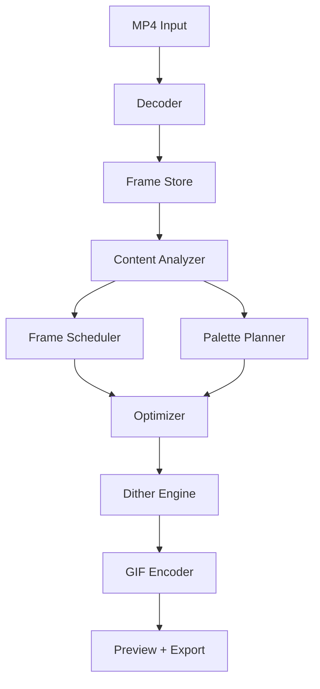

# Perceptual GIF Compressor Technical Design

## Summary

Build a Windows-first desktop app that compiles short MP4 videos into optimized GIFs using perceptual frame selection, modern color quantization, adaptive dithering, and GIF bitstream optimization.

Recommended stack:

- Desktop shell: Tauri.
- UI: React, Svelte, or Solid.
- Core engine: Rust.
- Decoder: system FFmpeg/FFprobe for MVP.
- ML runtime: ONNX Runtime or Windows ML in V2.
- Packaging: Portable Windows executable first, installer optional later.

## High-Level Architecture



## Core Modules

### app-ui

Owns the desktop experience:

- Drag/drop input.
- Mode selection.
- Preview rendering.
- Progress display.
- Candidate comparison.
- Export path selection.

The UI should communicate with the core through typed commands/events. Long-running jobs should stream progress and intermediate preview assets.

### decoder

MVP uses the user's system FFmpeg installation to decode MP4 into normalized frame buffers.

Responsibilities:

- Probe input metadata.
- Decode frames.
- Downscale early when possible.
- Extract timestamps.
- Provide frame access to analyzer.

Risks:

- Clear prerequisite detection and setup guidance.
- Bundled binary size.
- Codec compatibility expectations.

### analyzer

Computes compact signals for each frame:

- Motion intensity.
- Scene boundary score.
- Histogram difference.
- Edge density.
- Text/UI likelihood.
- Face/subject/saliency score in later versions.
- Compression cost estimate.

This module should produce frame-level metadata, not choose frames directly.

### scheduler

Chooses which frames survive.

MVP frame score:

```text
score =
  motion_score * 0.30
+ scene_change_score * 0.20
+ edge_or_text_score * 0.15
+ temporal_spacing_score * 0.15
+ visual_quality_score * 0.10
- compression_cost_penalty * 0.10
```

The scheduler should support variable frame delays. Repeated or low-value frames can be removed and represented by longer delays.

V2 can replace or augment this with an ONNX neural sampler.

### palette-planner

Builds palettes in a perceptual color space.

Recommendation:

- Prefer OKLab/OKLCH internally.
- Keep Lab as a fallback and for documentation familiarity.
- Use weighted clustering based on frame importance and region importance.
- Avoid per-frame palette instability.

Palette strategies:

- Global palette: simplest and stable.
- Segment palette: better color quality across scene changes.
- Hybrid temporal palette: global base plus segment-specific deltas.

MVP should implement global or segment palette first. Hybrid temporal palette can wait until V1.

### quantizer

Maps source pixels to palette indices.

Requirements:

- Weighted clustering.
- Color distance in OKLab/Lab.
- Region-aware weights.
- Optional comparison backend using libimagequant.

libimagequant is useful as a baseline or fallback because it is mature and perceptual. The custom quantizer is still important for temporal behavior and product differentiation.

### dither-engine

Applies controlled dithering after quantization.

Modes:

- Clean: minimal noise, good for UI/text/anime.
- Film: subtle blue-noise-like texture, good for camera footage.
- Pixel: stylized retro output.

Avoid uniform dithering strength. Text edges and flat backgrounds should receive lower dither. Textured regions can tolerate more.

### optimizer

Searches for the best output under constraints.

Inputs:

- Target size.
- Mode.
- Max width.
- Quality bias.
- Candidate count.

Parameters to search:

- Output width.
- Effective frame count.
- Frame delays.
- Palette size.
- Dither strength.
- Lossy threshold.

The optimizer should run in passes:

1. Fast estimate pass.
2. Candidate generation pass.
3. Final encode pass.

### encoder

Writes optimized GIFs.

Must support:

- Frame rectangle cropping.
- Transparent unchanged pixels.
- Disposal method selection.
- Repeated frame merging.
- Palette index ordering when useful.
- LZW-friendly output.

Existing encoders can be used initially, but the abstraction should allow custom bitstream optimization later.

## Data Flow

1. UI submits input path and mode.
2. Decoder probes file and emits metadata.
3. Decoder extracts scaled frame samples for analysis.
4. Analyzer computes frame metadata.
5. Scheduler builds candidate frame timelines.
6. Palette planner creates palette strategy.
7. Optimizer explores candidate settings.
8. Encoder produces preview GIFs.
9. User selects and exports final result.

## Performance Budget

Target input:

- 15 seconds.
- 720p to 1080p source.
- Common phone MP4.

Expected MVP behavior:

- First analysis feedback within 1-2 seconds.
- Auto candidate under 20-40 seconds on a normal Windows laptop.
- UI remains responsive during processing.

Optimization tactics:

- Analyze downscaled frames.
- Decode only necessary frame samples first.
- Use rayon or similar Rust parallelism for image analysis.
- Cache intermediate frame metadata.
- Run candidate encodes in parallel when CPU allows.

## Model Strategy

Do not block MVP on ML.

V2 neural sampler:

- Input: windows of downscaled frames plus metadata channels.
- Output: keep probability, importance class, optional delay recommendation.
- Runtime: ONNX.
- Hardware: CPU first, optional Windows GPU acceleration later.

Training data can be bootstrapped from:

- Existing high-quality GIF conversions.
- Human preferences between candidates.
- Synthetic labels from heuristic scheduler.

## Windows Packaging

Use Tauri for:

- Small app shell.
- Optional native Windows installer later.
- Bundled Rust core.
- Sidecar binaries.

Packaging concerns:

- FFmpeg prerequisite messaging.
- Code signing.
- Windows Defender false positives.
- GPU runtime availability.
- Portable build as the default release shape.

## Architecture Decisions

### ADR 1: Tauri Over Electron

Decision: Use Tauri.

Rationale:

- Smaller download.
- Rust backend fits image-processing core.
- Good Windows desktop packaging.
- Web UI still enables rich visual design.

Tradeoff:

- WebView differences need testing.
- Fewer off-the-shelf desktop plugins than Electron.

### ADR 2: Rust Core

Decision: Implement core processing in Rust.

Rationale:

- Good performance and memory control.
- Strong package ecosystem for image work.
- Natural fit with Tauri.
- Easier to parallelize CPU-heavy processing.

Tradeoff:

- More implementation effort than scripting FFmpeg commands.

### ADR 3: System FFmpeg in MVP

Decision: Use the system FFmpeg/FFprobe installation for decoding and baseline GIF export initially.

Rationale:

- Best MP4 compatibility.
- Faster MVP.
- Clear baseline behavior.
- Smaller download.
- Avoids FFmpeg redistribution and license packaging work in the first distributable build.

Tradeoff:

- Users must have FFmpeg installed and available on PATH.
- The app must provide very clear diagnostics when FFmpeg is missing or misconfigured.

### ADR 4: Heuristic First, Neural Later

Decision: Ship heuristic perceptual scheduling before neural scheduling.

Rationale:

- Explainable.
- Fast.
- No model training blocker.
- Works offline on low-end machines.

Tradeoff:

- Marketing claim should avoid overstating neural behavior until V2.

## Testing Plan

Test corpus:

- Face/selfie clips.
- Text/subtitle clips.
- Game footage.
- Screen recordings.
- Low-light noisy footage.
- Fast camera motion.
- Anime/cartoon clips.

Automated tests:

- Decoder metadata parsing.
- Frame scheduler invariants.
- Palette generation determinism.
- GIF file validity.
- Target-size convergence.
- Regression snapshots for sample clips.

Manual tests:

- Visual flicker.
- Text readability.
- Loop smoothness.
- Output size predictability.
- UI responsiveness.

## Main Risks

- GIF format limits may disappoint users expecting MP4-like quality.
- Neural feature claims can get ahead of actual model performance.
- Palette instability can cause flicker.
- FFmpeg PATH configuration can confuse non-technical users.
- Processing may be slow without careful sampling and caching.

## Recommended Build Order

1. Tauri shell with drag/drop and preview.
2. FFmpeg probe/decode bridge.
3. Baseline GIF export.
4. Heuristic frame scheduler.
5. OKLab/Lab quantizer.
6. Adaptive dither modes.
7. Size-constrained optimizer.
8. Candidate preview.
9. Portable Windows release.
10. Neural sampler prototype.
